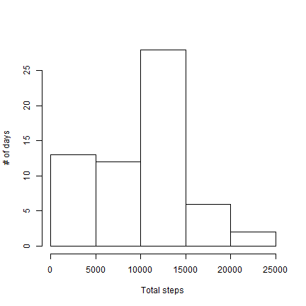
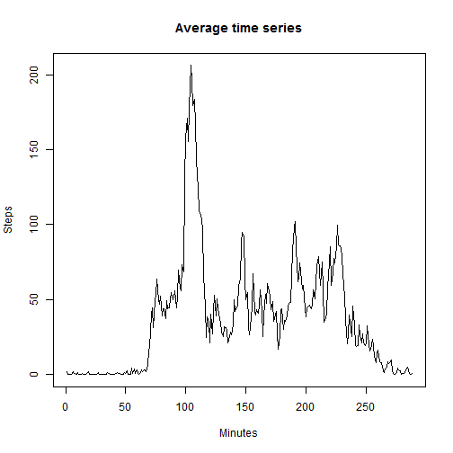
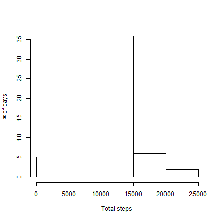

# Reproducible Research: Peer Assessment 1


## Loading and preprocessing the data

First we load the data

```r
data <- read.csv("activity.csv")
```


## What is mean total number of steps taken per day?

This is the histogram of the total number of steps per day

```r
sumxdate <- unlist(by(data$steps, data$date, sum, na.rm = TRUE))
hist(sumxdate, xlab = "Total steps", ylab = "# of days", main = "")
```

 


The  mean total number of steps taken per day

```r
mean(sumxdate)
```

```
## [1] 9354
```

The  median total number of steps taken per day

```r
median(sumxdate)
```

```
## 2012-10-20 
##      10395
```


## What is the average daily activity pattern?


```r
meanxint <- unlist(by(data$steps, data$interval, mean, na.rm = TRUE))
plot(meanxint, type = "l", xlab = "Minutes", ylab = "Steps", main = "Average time series")
```

 


The interval corresponding to the maximum average number of steps is:

```r
which.max(meanxint)
```

```
## 835 
## 104
```

First numbercorresponds to the hour (ex. 835 means 8:35)  
Second number corresponds to the actual interval index

## Imputing missing values

The total number of rows with missing step data is:

```r
sum(is.na(data[, 1]))
```

```
## [1] 2304
```

We will fill missing values with the average number of steps in that interval


```r
dataf <- data
r <- rep(meanxint, length(split(data, data$date)))
dataf[is.na(dataf[, 1]), 1] <- r[is.na(dataf[, 1])]
```

Now the total number rows with missing step data is:

```r
sum(is.na(dataf[, 1]))
```

```
## [1] 0
```


We plot the histogram of total steps per day and calculate mean and median as above with the new dataset:


```r
sumxdate2 <- unlist(by(dataf[, 1], dataf[, 2], sum, na.rm = TRUE))
hist(sumxdate2, xlab = "Total steps", ylab = "# of days", main = "")
```

 

```r

mean(sumxdate2)
```

```
## [1] 10766
```

```r

median(sumxdate2)
```

```
## 2012-11-04 
##      10766
```


We can see that imputing missing data increased the total number of steps, as expected.

## Are there differences in activity patterns between weekdays and weekends?


```r
Sys.setlocale("LC_TIME", "English")
```

```
## [1] "English_United States.1252"
```

```r
dataf$week <- weekdays(as.POSIXlt(dataf$date))
dataf$day[dataf$week %in% c("Monday", "Tuesday", "Wednesday", "Thursday", "Friday")] <- c("weekday")
dataf$day[dataf$week %in% c("Saturday", "Sunday")] <- c("weekend")
dataf$day <- factor(dataf$day)
```


Plot of time series divided weekends and weekdays:

```r
library(lattice)
ag <- aggregate(steps ~ day + interval, data = dataf, FUN = "mean")
xyplot(steps ~ interval | day, data = ag, layout = c(1, 2), type = "l")
```

 


